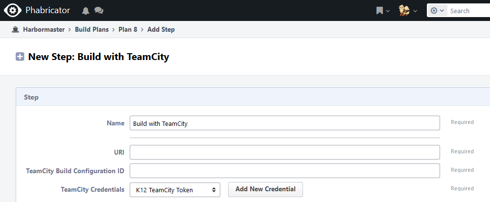
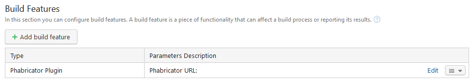
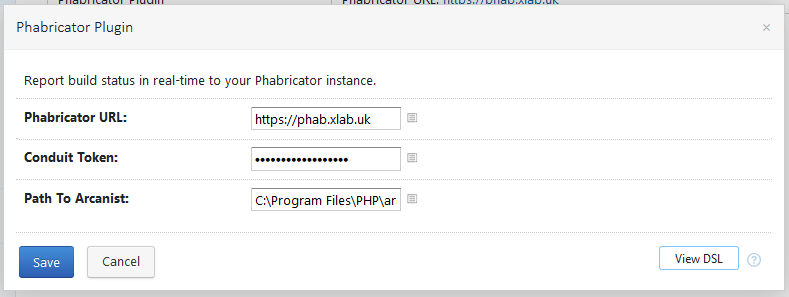

# Teamcity-Phabricator-Plugin
Connecting Phabricator and TeamCity to run builds with changes from code reviews and report the results.

## Plugins

There are two plugins that work hand-in-hand to enable TeamCity builds with changes from a Phabricator code review. If you are unfamiliar to [Phabricator](https://www.phacility.com/phabricator/) and their terminologies see the  **Background** section below for an overview.

**Harbormaster-Teamcity-Plugin:**
An extension to Phabricator to enable triggering of builds within TeamCity using Harbormaster.

**Teamcity-Phabricator-Plugin:**
A TeamCity plugin that patches in changes from a Phabricator code review and reports the build status back to Phabricator.

## Background - Phabricator Workflow & Terminology
The Phabricator Software Development Suite has the ability for code review, CI & CD along side numerous other development tools.

Phabricator code reviews are called [_Differential Revisions_](https://www.phacility.com/phabricator/differential/). Phabricator differs to other code review workflows because they are pre-commit reviews and therefore the changes that are getting peer reviewed are not in version control. This gives Phabricator a _write_, _review_, then _merge_ workflow, which is different than most pull-request methodologies such as GitHub. In this workflow our code changes are managed by Phabricator and are not in version control during the code review process for us to build with CI.

To trigger a _Differential Revision_ (code review) a command line tool called [_Arcanist_](https://www.phacility.com/phabricator/arcanist/) is used. This tool handles the interaction with Phabricator to request, update and merge code reviews. An example of putting code up for review would be running _Arcanist_ like: `arc diff`. This would essentially mimic pushing a feature branch and creating a PR. If another developer wanted to pull down a copy of the changes to review in-depth they would also use _Arcanist_ to patch in the changes: `arc patch <Differential ID>`.

When a _Differential Revision_ is created, Phabricator has the ability to to trigger CI "builds" with the changes, this feature is called _Harbormaster_. These _Harbormaster_ builds usually trigger other build systems which report back the results, one of the in-built triggers is for Jenkins. There is **no** inbuilt trigger for TeamCity.

## Why TeamCity Phabricator Plugins

As outlined above, Phabricator does not have a default trigger for TeamCity. To add a TeamCity trigger we have extended Harbormaster with `Harbormaster-Teamcity-Plugin` which adds the relevant files to communicate with TeamCity to run build configurations. The plugin also sends additional information to TeamCity for the partner plugin to use when reporting the result back to Phabricator.

Since code review changes are not in version control we cannot rely on TeamCity to patch in the changes using Git. We needed to create a plugin that listened and identified builds triggered by `Harbormaster-Teamcity-Plugin` and then utilise _Arcanist_ to patch in the exact changes that need to be built before reporting the result back to Phabricator.

## Installation

### Harbormaster-Teamcity-Plugin

The harbormaster plugin allows us to trigger a build configuration within TeamCity as part of a harbormaster build plan.

To deploy simply copy the contents of the `Harbormaster-Teamcity-Plugin` folder in to `src/extensions/` on the Phabricator instance and then restart the application. Currently there are only three files that need to be transfered: `HarbormasterTeamCityBuildStepImplementation.php`, `PassphraseTokenKey.php` & `TeamCityXmlBuildBuilder.php`.

The Harbormaster build trigger requires:
1. TeamCity URI: The URL to your TeamCity instance
2. TeamCity Build Configuration ID for the build differential revision changes should be applied
3. TeamCity Credentials: A TeamCity REST API token to authenticate with the server stored within Phabricator's _PassPhrase_ feature.

### Teamcity-Phabricator-Plugin

The TeamCity plugin comprises of server and agent plugins for TeamCity. Together they collate the information sent from `Harbormaster-Teamcity-Plugin` and run _Arcanist_ to pull in the changes from the associated _Differential Revision_.

To deploy, upload the `Teamcity-Phabricator-Plugin-<version>.zip` on TeamCity's plugin administration page.

This will install the **Phabricator Plugin** build feature that can be enabled per build configuration used for _Differential Revisions_.

The plugin requires `Harbormaster-Teamcity-Plugin` to be installed on Phabricator and the following to be configured in the TeamCity build feature:

1. Phabricator URL: The URL to your Phabricator instance
2. Conduit Token: A Phabricator API token related to a user (should be a Bot user to follow best practices)
3. Path to Arcanist on the build agents. (In future we will remove the hard-coded path and look on the path for `arc`)

## Development

### Harbormaster-Teamcity-Plugin
No building is needed for the harbormaster plugin just dev away and copy the files into the `src/extensions` folder with your Phabricator instance.

### Teamcity-Phabricator-Plugin

You will need to move in to the `Teamcity-Phabricator-Plugin/` folder:

* To build the plugins (server and agent) just run: `mvn clean compile package`

By default the TeamCity plugin is equipped with `teamcity-sdk-maven-plugin` which allows for developing against a local instance of TeamCity with debugging capabilities. See their documentation for how to use: https://github.com/JetBrains/teamcity-sdk-maven-plugin

## Future Development:
* Look for _Arcanist_ on the path rather than hard-coding it.
* Report back unit tests

## Credits

The inspiration for the plugin is from https://github.com/halfmatthalfcat/TeamCity-Phabricator-Plugin which is no longer maintained. We have reused the Harbormaster files from the original authors repository.

## Some Useful Links

A collection of useful links that help when diving into TeamCity plugin development:

* https://confluence.jetbrains.com/display/TCD10/Web+UI+Extensions
* http://javadoc.jetbrains.net/teamcity/openapi/current/allclasses-noframe.html
* https://github.com/JetBrains/teamcity-sdk-maven-plugin/wiki/Developing-TeamCity-plugin
* https://www.quali.com/blog/teamcity-plugin-development-journey/
* https://plugins.jetbrains.com/docs/teamcity/plugin-development-faq.html
* https://plugins.jetbrains.com/docs/teamcity/getting-started-with-plugin-development.html
